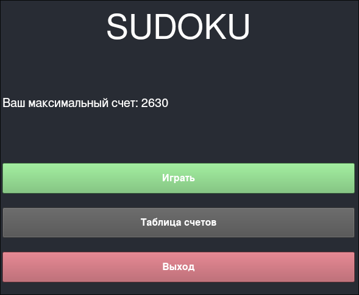
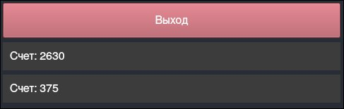
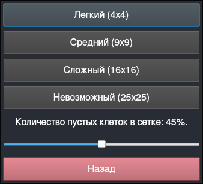
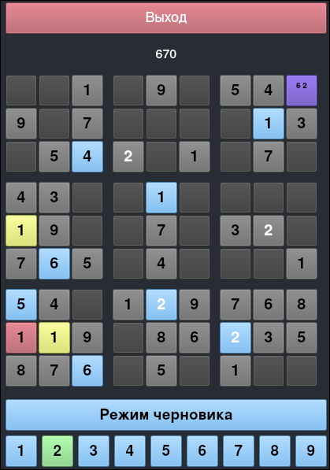

# Sudoku Game

## Внешний вид приложения

#### Главное меню


#### Таблица счетов


#### Выбор уровня сложности


#### Игровое поле


### Установка

#### Зависимости
```
cmake
make
gcc
qt6-base
```

##### Arch
```
sudo pacman -S cmake make gcc qt6-base
```

##### Для Windows потребуется установить [MSYS2](https://www.msys2.org/) и использовать MINGW терминал
```
pacman -Sy mingw-w64-x86_64-cmake make gcc mingw-w64-qt6-base
```

##### склонируйте этот репозиторий к себе на компьютер
```
git clone https://github.com/VinTiUm00/Sudoku-project/
```

##### перейдите в каталог build
```
cd ./Sudoku-project/build
```

##### выполните следующую команду
###### Unix
```
cmake .. && make
```
###### Windows
```
cmake -G "Unix Makefiles" .. && make
```

##### Готово. Вы скомпилировали нашу игру. Для запуска откройте файл Sudoku
###### Unix
```
./Sudoku
```

### Авторы
Бондаренко Егор 8В41

Воронцов Юрий 8В41
